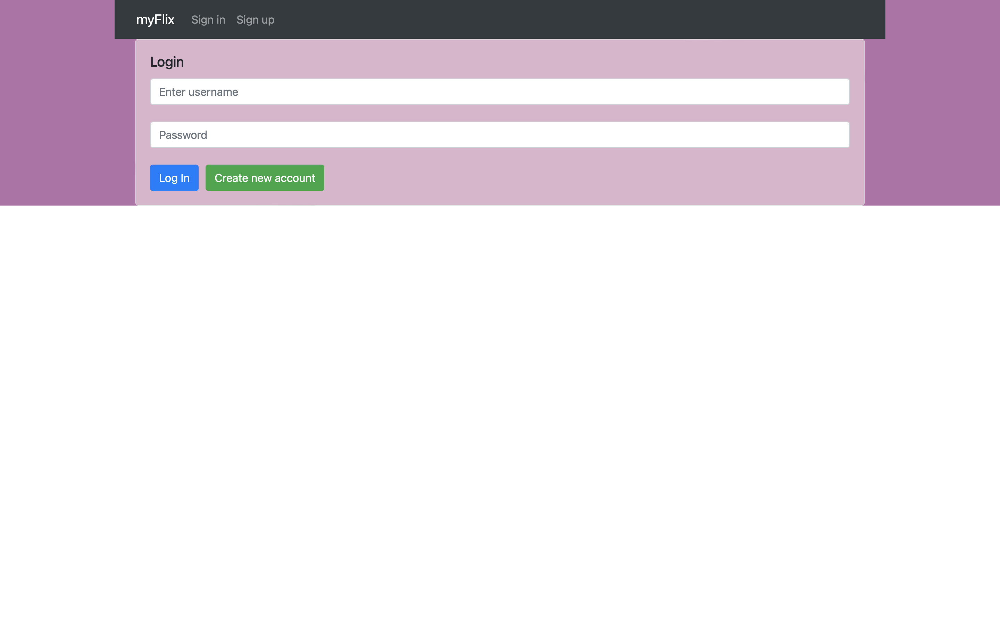
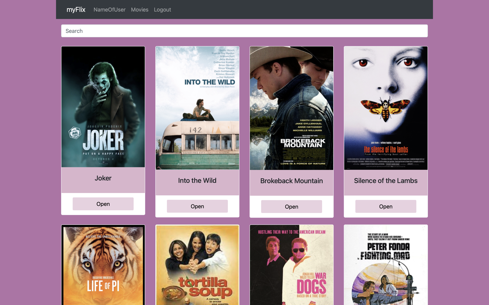
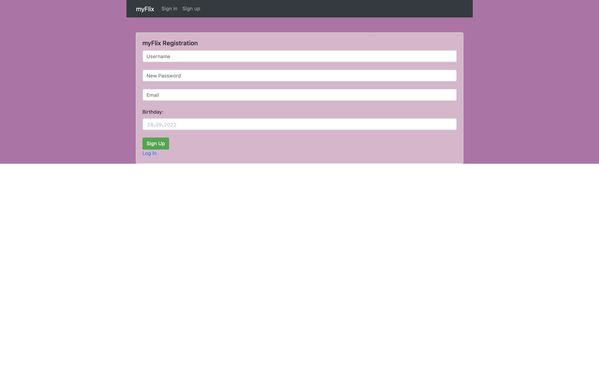
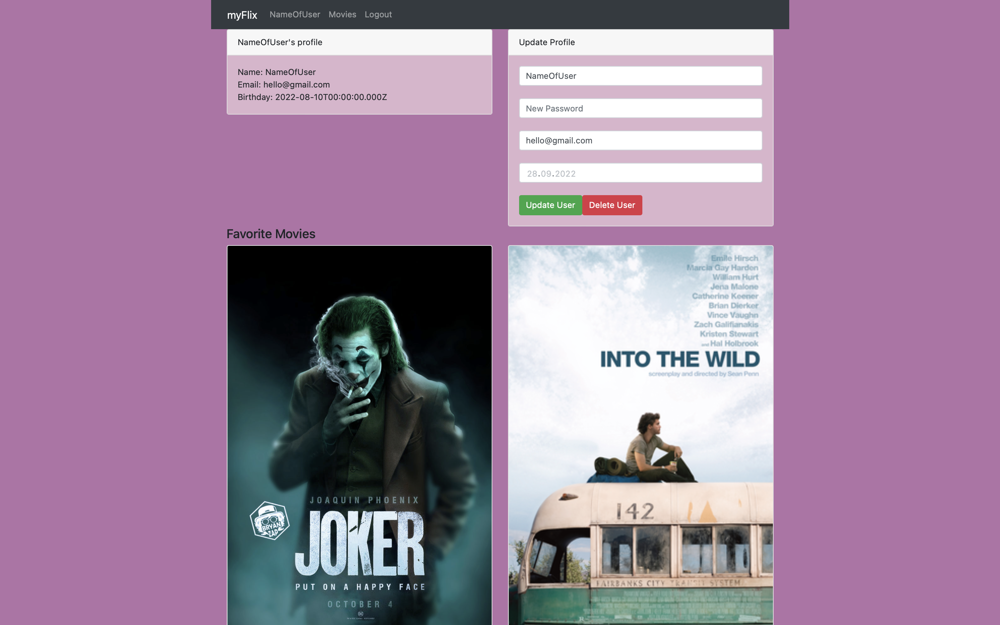
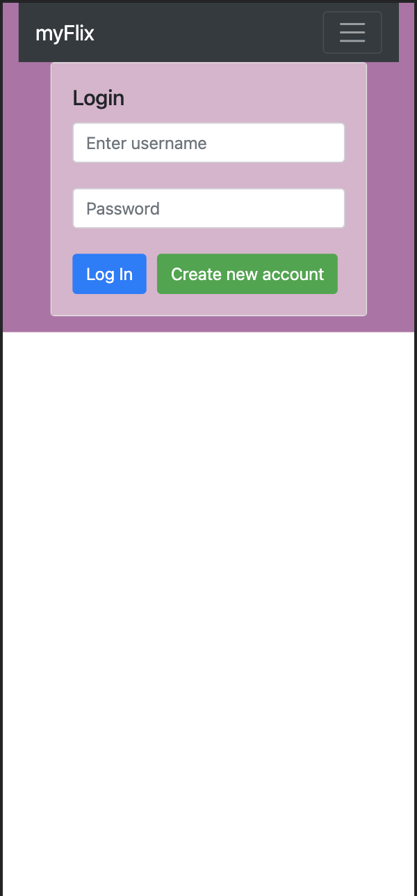
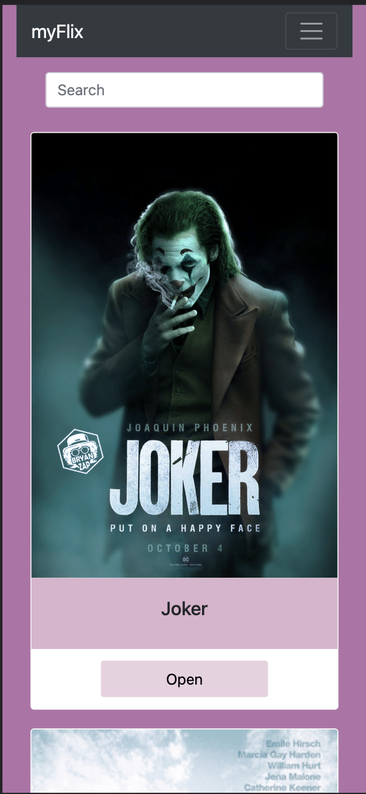
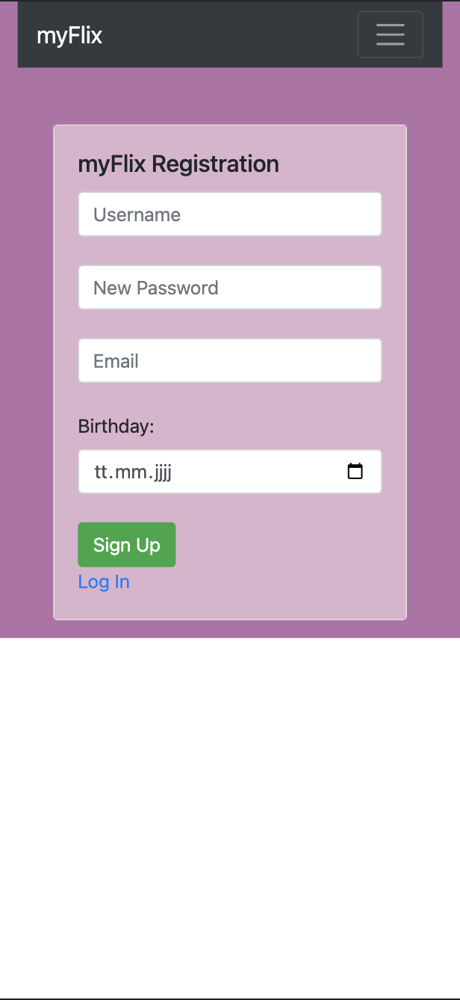
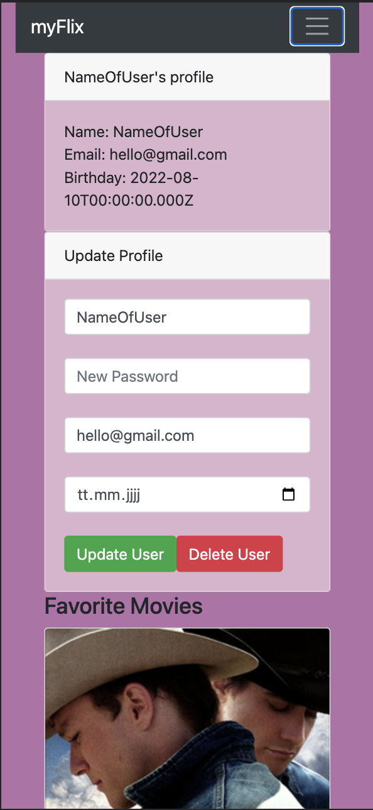

# myFlix-client

This is the client side of the myFlix app.
The myFlix app is a Movie library where you can seacr hfor movies and add the movies you like to your favorite movie list.

## Framework:
* React

## API:
It interfaces with a Webserver API called myFlixDB which was built with Node.js, Express and MongoDB

## The Client-side was built with:
* React
* Parcel
* JS
* Redux

## Features

### characteristics:
* Single-Page-Application (SPA)
* responsive design
* lots of interactions

### functions:
* Sign up to create an account
* login
* update account
* add/delete movies to/from a list of favorite movies
* Sort movies by fields like genre or director

## Screenshots:
### Desktop-Version:

### Mobile-Version:

## Deployed on Netlify.com: 
<a href="https://app-my-flix.netlify.app">MyFlixApp</a>

(<a href="#top">back to top</a>)

